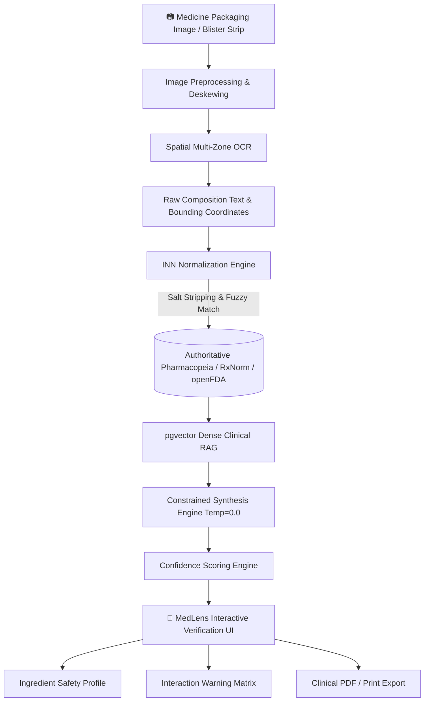

<div align="center">

# 🔬 MedLens
### *Spatial Bio-Vision & Pharmaceutical Composition Intelligence*

**Decoding cryptic blister packs • Demystifying chemical salts • Preventing adverse drug events**

[](https://nextjs.org/)
[](https://react.dev/)
[](https://www.typescriptlang.org/)
[](https://tailwindcss.com/)
[](./LICENSE)

<p align="center">
  <b>An image-first clinical verification engine transforming micro-printed packaging, unreadable foil typography, and complex chemical salts into crystal-clear, verified medical truth.</b>
</p>

</div>

---

## 📑 Table of Contents

- [The Problem We Solve](#-the-problem-we-solve)
- [Key Features](#-key-features)
- [System Architecture](#-system-architecture)
- [Tech Stack](#-tech-stack)
- [Repository Structure](#-repository-structure)
- [Getting Started](#-getting-started)
  - [Prerequisites](#prerequisites)
  - [Installation & Local Run](#installation--local-run)
  - [Building for Production](#building-for-production)
- [Core Verification Engine Workflow](#-core-verification-engine-workflow)
- [Safety & Medical Disclaimer](#-safety--medical-disclaimer)
- [License](#-license)

---

## 🚨 The Problem We Solve

1. **Illegible Packaging & Micro-Typography:** Active pharmaceutical ingredients (APIs), salt compounds, and excipients are often printed in tiny, curved, or low-contrast text on metallic foils.
2. **Medical Jargon & Salt Complexities:** Patients struggle to distinguish between brand names (*e.g., Augmentin*) and active compounds (*Amoxicillin + Clavulanic Acid*), leading to unintentional double-dosing.
3. **Adverse Drug Interactions:** Over-the-counter co-administration often occurs without cross-referencing contraindications, chronic condition risks, or pregnancy safety categories.
4. **Hallucination Risk in Generic AI:** General-purpose LLMs hallucinate medical dosages. MedLens mitigates this with deterministic salt normalization, strict RAG retrieval against authoritative pharmacopeias, and confidence-scored verification.

---

## ✨ Key Features

- **📸 Multimodal Label OCR & Spatial Text Parsing:**
  Detects and extracts active pharmaceutical ingredients even on wrinkled foils, curved vials, or noisy camera shots with bounding-box spatial awareness.
- **🧪 INN Salt Normalization & Disambiguation:**
  Strips salt prefixes/suffixes (e.g., *hydrochloride*, *potassium*, *maleate*) and matches standard International Nonproprietary Names (INN) against RxNorm, PubChem, and FDA registries.
- **🛡️ Multi-Axis Safety & Interaction Matrix:**
  Comprehensive safety profiling covering pregnancy categories (A–X), kidney/liver warnings, allergic triggers, dietary contraindications (e.g., alcohol, grapefruit), and pediatric safety.
- **📊 Mathematical Confidence Scoring Engine:**
  Every analyzed medicine receives an explainable composite confidence score:
  $$\text{Confidence}_{\text{final}} = w_1 \cdot C_{\text{OCR}} + w_2 \cdot C_{\text{Match}} + w_3 \cdot C_{\text{Clinical}}$$
- **💻 Ultra-Modern Glassmorphic Interactive UI:**
  Built with Next.js 16 and Tailwind CSS, featuring live image uploads, dynamic interactive ingredient cards, dosage timelines, drug interaction simulators, and printable report generation.

---

## 🏛️ System Architecture



---

## 🛠️ Tech Stack

### Frontend & Application Layer
- **Framework:** [Next.js 16.3](https://nextjs.org/) (App Router, Turbopack)
- **Library:** [React 19](https://react.dev/)
- **Language:** [TypeScript 5](https://www.typescriptlang.org/)
- **Styling:** [Tailwind CSS](https://tailwindcss.com/) with custom design system tokens & glassmorphic aesthetics
- **Icons:** [Lucide React](https://lucide.dev/)
- **Typography:** Geist & Geist Mono fonts

### Planned Clinical Analysis & Verification Pipeline
- **OCR:** Spatial Tesseract / Google Cloud Vision API
- **Normalization:** Python INN Salt Normalizer + Levenshtein / Soundex phonemic matching
- **Clinical Knowledge Bases:** RxNorm, openFDA Drug Label API, PubChem, WHO Essential Medicines
- **RAG & Storage:** PostgreSQL + pgvector dense retrieval

---

## 📂 Repository Structure

```
MedLens/
├── frontend/                     # Next.js 16 Application
│   ├── app/
│   │   ├── favicon.ico           # MedLens branding icon
│   │   ├── globals.css           # Global Tailwind tokens & keyframe animations
│   │   ├── layout.tsx            # HTML root metadata & font loading
│   │   └── page.tsx              # Full interactive verification engine UI
│   ├── public/                   # Web-optimized assets & demonstration visuals
│   │   ├── 37864170-*.png        # Interactive pill verification showcase
│   │   ├── c7f09fc4-*.png        # Architecture pipeline diagram asset
│   │   ├── e1697cba-*.png        # Hero badge asset
│   │   └── real_medicine_tablet.jpg # High-resolution blister strip demo sample
│   ├── eslint.config.mjs         # Linter configuration
│   ├── next.config.ts            # Next.js configuration
│   ├── package.json              # Frontend dependencies and scripts
│   ├── postcss.config.mjs        # PostCSS configuration
│   └── tsconfig.json             # Strict TypeScript configuration
├── .gitignore                    # Comprehensive repo-level gitignore
├── LICENSE                       # MIT License
└── README.md                     # Project documentation & setup guide
```

---

## 🚀 Getting Started

### Prerequisites

- **Node.js:** `v18.17.0` or higher (Node.js 20+ recommended)
- **Package Manager:** `npm` (comes with Node.js), `yarn`, or `pnpm`
- **Git**

### Installation & Local Run

1. **Clone the repository:**
   ```bash
   git clone https://github.com/UdeepChowdary/MedLens.git
   cd MedLens
   ```

2. **Navigate to the frontend directory:**
   ```bash
   cd frontend
   ```

3. **Install dependencies:**
   ```bash
   npm install
   ```

4. **Start the development server:**
   ```bash
   npm run dev
   ```

5. **Open your browser:**
   Navigate to [http://localhost:3000](http://localhost:3000) to view the application.

---

### Building for Production

To validate TypeScript types and compile an optimized production bundle:

```bash
cd frontend
npm run build
npm run start
```

---

## 🧪 Core Verification Engine Workflow

1. **Image Ingestion:**
   Upload or capture a photo of any medicine tablet strip, carton, or bottle.
2. **Text Normalization:**
   The parser isolates chemical active ingredients from brand marketing and package details.
3. **Clinical Lookup:**
   Standardizes variations (e.g., *Acetaminophen* vs. *Paracetamol*) and cross-references therapeutic classes.
4. **Safety Analysis:**
   Inspects organ toxicity (renal/hepatic), pregnancy risks, age limitations, and common side effects.
5. **Interactive Summary:**
   Provides an accessible breakdown for patients alongside technical details for medical professionals.

---

## ⚖️ Safety & Medical Disclaimer

> [!IMPORTANT]
> **MedLens is an informational assistive tool and does NOT replace professional medical advice, clinical diagnosis, or prescriptions.**
> Always consult a qualified healthcare provider or licensed pharmacist before starting, changing, or discontinuing any medication regimen. In case of a suspected adverse drug event or medical emergency, immediately contact your local emergency services or national poison control center.

---

## 📄 License

This project is licensed under the [MIT License](LICENSE).
